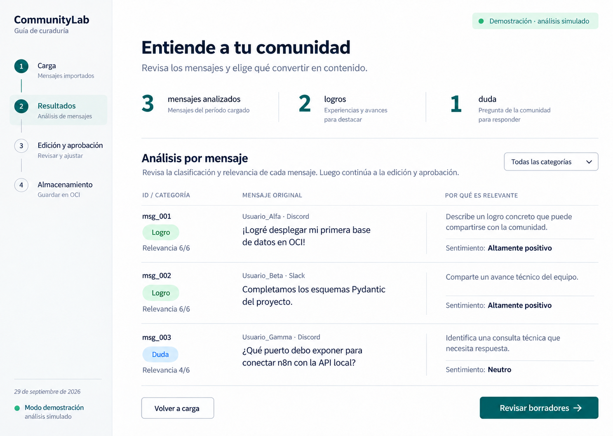
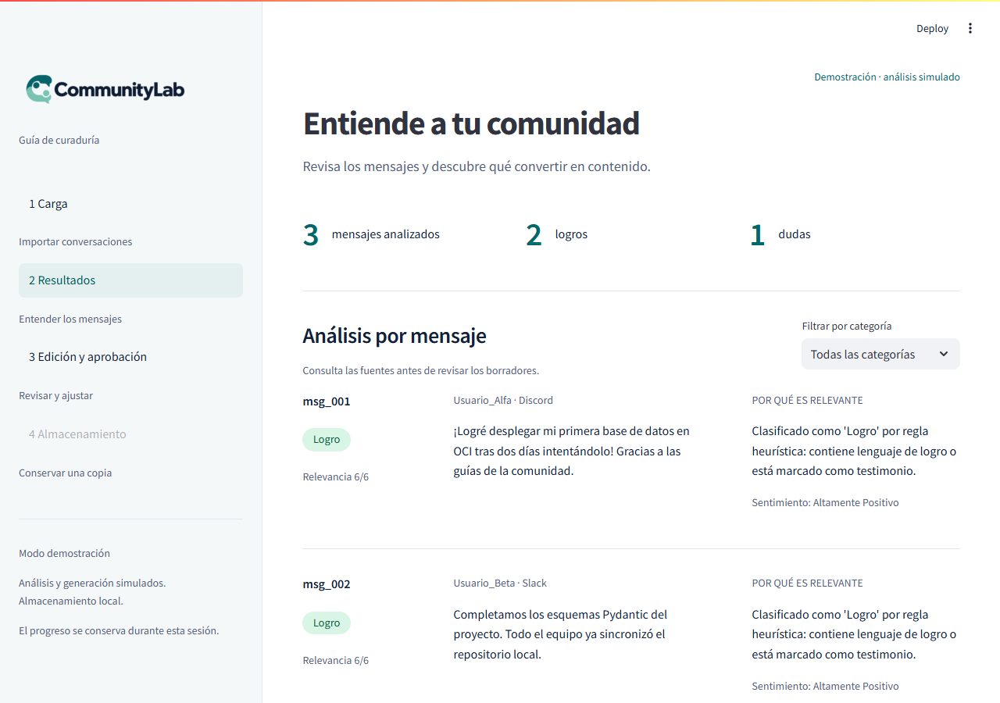
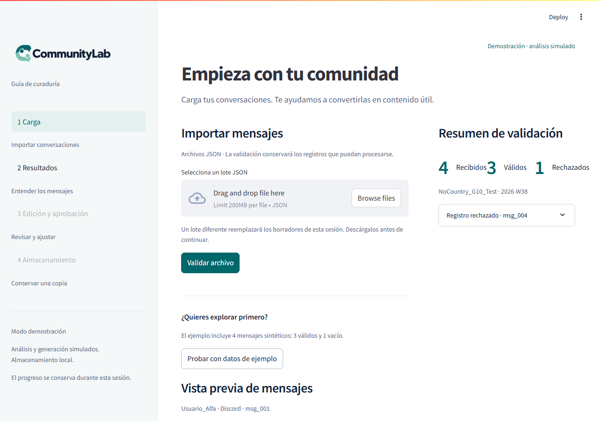
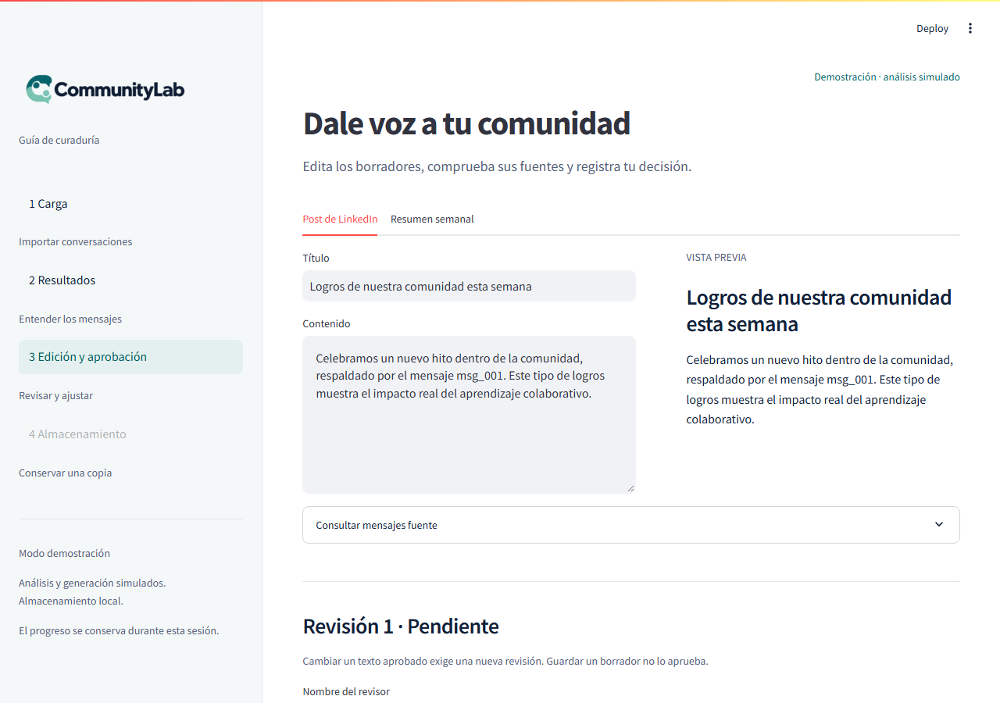
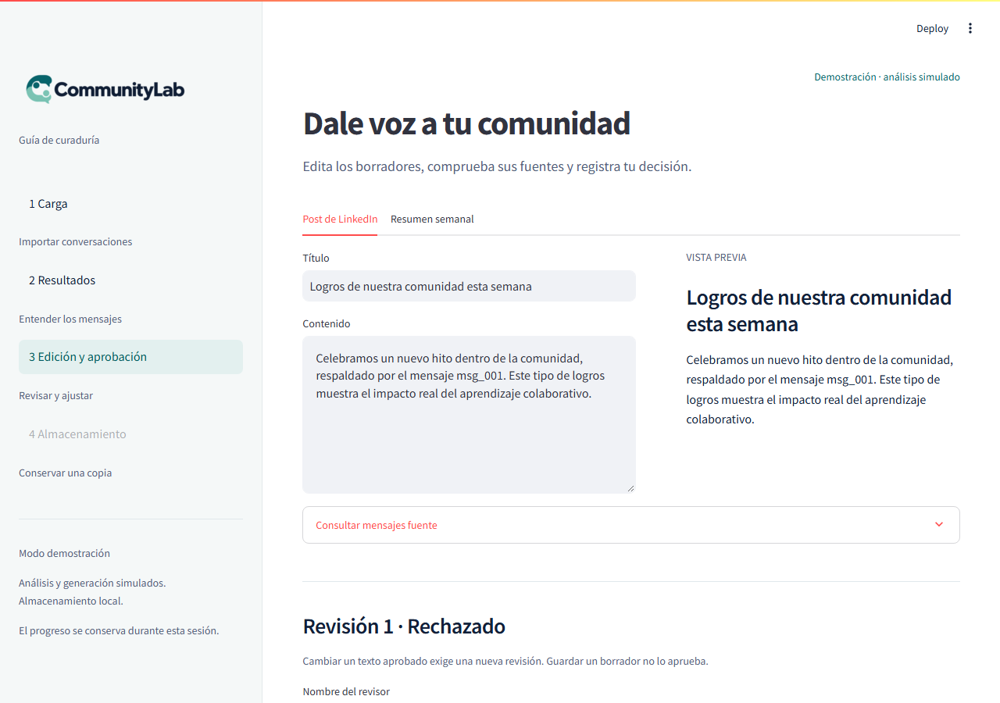
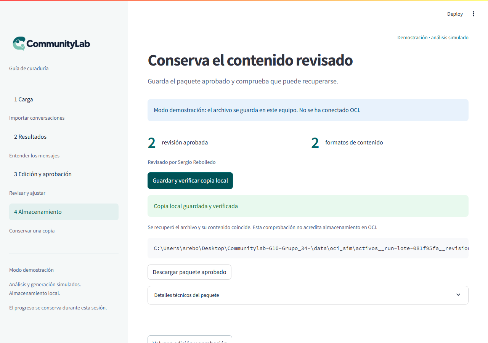

# CommunityLab — Equipo 34 (Hackathon ONE G10 / NoCountry)
> **Motor Inteligente de Transformación y Distribución para Comunidades Digitales**

Solución automatizada orientada a comunidades de aprendizaje, ecosistemas de desarrolladores y empresas SaaS para ingerir actividad orgánica (Discord, Slack, GitHub, Foros) y transformarla sistemáticamente en activos de marketing estructurados y persistidos en **Oracle Cloud Infrastructure (OCI Always Free)**.

---

## 🏗️ Arquitectura y Recorrido de Integración


```
[n8n / Webhook / Carga Manual]
            │
            ▼
┌───────────────────────────────┐
│     FastAPI Ingestion API     │ ──> Guarda atómicamente en `data/raw/`
└───────────────────────────────┘
            │
            ▼
┌───────────────────────────────┐
│      Validador Local          │ ──> Aplica `InteraccionValidada`
└───────────────┬───────────────┘
                │
        ┌───────┴───────┐
        ▼               ▼
┌───────────────┐ ┌──────────────────────────┐
│   3 Válidos   │ │ 1 Rechazado (Sin Texto)  │
│  Agentes LLM  │ │  Tabla Auditoría Local   │
└───────┬───────┘ └──────────────────────────┘
        │
        ▼
┌───────────────────────────────┐
│     Generación de Activos     │ ──> LinkedIn + Resumen Semanal (`source_ids`)
└───────────────┬───────────────┘
                │
        ┌───────┴────────────────────────┐
        ▼                                ▼
┌───────────────────────────────┐ ┌─────────────────────────────────┐
│  Borrador `revision-001.json` │ │    Panel Streamlit (Curaduría)   │
│   OCI Object Storage (Sync)   │ │  Aprobación -> `revision-002`   │
└───────────────────────────────┘ └─────────────────────────────────┘
```

## 📦 Estado actual del código

| Componente | Contrato / módulo | Estado |
| :--- | :--- | :---: |
| Contratos de datos (Pydantic) | `esquemas.py` (`IngestionLote`, `AnalisisCognitivo`, `PaqueteSalida`) | ✅ Implementado y acordado por el equipo |
| Validación local en 2 capas | `validador.py` | ✅ Implementado |
| Panel de curaduría (Streamlit) | `ui/app.py`, `ui/styles.css`, `ui/mock_pipeline.py`, `ui/storage_demo.py` | ✅ Implementado (análisis y OCI aún simulados, ver sección abajo) |
| Análisis cognitivo real (LLM) | `ai_modules/cognitive_analyzer.py` | ⏳ Pendiente |
| Generación de copy real (LLM) | `ai_modules/copy_generator.py` | ⏳ Pendiente |
| Orquestación (LangGraph) | `orchestration/pipeline_runner.py` | ⏳ Pendiente |
| Cliente OCI Object Storage real | `storage/oci_client.py` | ⏳ Pendiente (`ui/storage_demo.py` simula solo en disco local mientras tanto) |
| API de ingesta (FastAPI) | `api/` | ⏳ Pendiente |

## 📋 Evidencias Técnicas: Primera Prueba de Integración

### 1. Dataset de Prueba Sintético (`data/raw/lote_prueba_01.json`)
Contiene los 4 escenarios canónicos exigidos por la arquitectura:
- **`msg_001` (Logro / Testimonio)**: Éxito de despliegue en OCI (`Usuario_Alfa`).
- **`msg_002` (Logro / Avance)**: Completitud de esquemas Pydantic (`Usuario_Beta`).
- **`msg_003` (Duda técnica)**: Consulta de configuración de webhook en n8n (`Usuario_Gamma`).
- **`msg_004` (Inválido)**: Registro con `texto: ""` para comprobar el aislamiento de fallos (`Usuario_Delta`).

### 2. Resultados de la suite de pruebas
Comando ejecutado:
```bash
python -m pytest tests/ -v
```

**Salida de consola obtenida (4 pruebas, todas en verde):**
```text
tests/test_frontend.py::test_review_flow_and_edit_invalidation PASSED
tests/test_frontend.py::test_local_storage_idempotence_and_collision PASSED
tests/test_primera_prueba.py::test_validacion_lote_prueba_01 PASSED
tests/test_primera_prueba.py::test_contrato_paquete_distribucion_generado PASSED
```

### 3. Criterios de Aceptación Verificados

| Criterio | Resultado Esperado | Estado |
| :--- | :--- | :---: |
| **Transporte y Validación** | 4 recibidos, 3 válidos a IA, 1 rechazado (`msg_004`) aislado en auditoría sin tumbar el lote | ✅ Superado |
| **Trazabilidad estricta** | Activos generados enlazan a `source_ids` sin inventar hechos | ✅ Superado |
| **Contrato Canónico** | Estructura 100% compatible con `PaqueteSalida` y `EvidenciaAlmacenamientoOCI` | ✅ Superado |
| **Flujo de curaduría end-to-end** | Carga → análisis → edición/aprobación → guardado local verificado, con validación de campos e invalidación al editar contenido aprobado | ✅ Superado (`tests/test_frontend.py`) |

---

## 🚀 Guía de Instalación y Ejecución Local

El equipo estandarizó **Python 3.11** y **[uv](https://docs.astral.sh/uv/)** como gestor de entorno/paquetes.

1. **Clonar el repositorio y entrar al directorio:**
   ```bash
   git clone https://github.com/No-Country-simulation/Communitylab-G10-Grupo_34-.git
   cd Communitylab-G10-Grupo_34-
   ```

2. **Crear el entorno virtual con Python 3.11 (uv lo descarga si no lo tienes):**
   ```bash
   uv python install 3.11
   uv venv --python 3.11
   # Activar en Windows:
   .venv\Scripts\activate
   ```

3. **Instalar dependencias:**
   ```bash
   uv pip install -r requirements.txt
   ```

4. **Configurar variables de entorno:**
   ```bash
   cp .env.example .env
   # Completar credenciales de OCI y del LLM en .env (nunca subir este archivo)
   ```

5. **Ejecutar la suite de pruebas:**
   ```bash
   python -m pytest tests/ -v
   ```

6. **Levantar el panel de curaduría (Streamlit):**
   ```bash
   python -m streamlit run ui/app.py
   ```
   Se abre en `http://localhost:8501`. Incluye un lote de ejemplo (`data/raw/lote_prueba_01.json`, botón "Probar con datos de ejemplo") para recorrer el flujo completo sin depender de canales reales.

---

## 🖥️ Panel de curaduría (`ui/`)

Interfaz Streamlit que cubre el requisito de UI del hackathon y la historia de usuario **[HU-S1-004 — Flujo de revisión humana](https://github.com/No-Country-simulation/Communitylab-G10-Grupo_34-/issues/8)**: cargar interacciones, revisar el análisis, editar/aprobar/rechazar los dos formatos de contenido y comprobar el estado de almacenamiento — en cuatro pasos (**Carga → Resultados → Edición y aprobación → Almacenamiento**), sobre el diseño aprobado por el equipo (verde petróleo `#00676B`, texto `#122039`/`#52627B`).

Diseño aprobado por el equipo (mockup de referencia) frente a la implementación real:

| Mockup aprobado | Implementación (pantalla "Resultados") |
| :---: | :---: |
|  |  |

### Recorrido completo, paso a paso

**1. Carga** — se sube un lote JSON o se usa el de ejemplo (`data/raw/lote_prueba_01.json`, 4 registros: 3 válidos + 1 vacío). El resumen muestra de inmediato cuántos se recibieron, validaron y rechazaron, con el motivo de cada rechazo.



**2. Resultados** — análisis por mensaje (sentimiento, categoría, relevancia 0-6 y justificación), con filtro por categoría y el texto original siempre visible junto a la clasificación.


**3. Edición y aprobación** — editor con vista previa en vivo para el post de LinkedIn y el resumen semanal, cada uno con sus mensajes fuente consultables (trazabilidad de `source_ids`).



El sistema exige nombre de revisor para cualquier decisión, y un motivo obligatorio para rechazar. Rechazar incrementa el número de revisión y vuelve el contenido a estado pendiente:



**4. Almacenamiento** — al aprobar, el panel avanza automáticamente a este paso. Guarda el paquete y **comprueba activamente la lectura posterior** antes de marcarlo como verificado; es honesto sobre que es una copia local, no OCI real:



Más capturas (incluida la pantalla inicial vacía y el estado post-aprobación) en [`docs/screenshots/`](docs/screenshots/).

### Archivos

- `ui/app.py` — navegación y presentación; consume directamente `esquemas.py` y `validador.py`, sin lógica de negocio propia.
- `ui/mock_pipeline.py` — clasificación y generación de copy **heurísticas**, no IA real. Es un reemplazo temporal de `ai_modules/` mientras ese módulo no exista.
- `ui/storage_demo.py` — guarda el paquete **solo en disco local** (`data/oci_sim/`, no versionado) y verifica la lectura posterior con comparación de contenido, incluyendo reintento idéntico (idempotente) y rechazo ante colisión. **Nunca marca el paquete como guardado en OCI real**: `almacenamiento_oci.status_almacenamiento` permanece en `"no_iniciado"` hasta que `storage/oci_client.py` exista y se conecte.
- `ui/assets/communitylab-logo.png` — logo oficial del proyecto, integrado en la barra lateral.
- Detalle adicional y notas de verificación en [`ui/README.md`](ui/README.md).

**Pendiente antes de conectar con servicios reales:** reemplazar `ui/mock_pipeline.py` por los módulos reales de `ai_modules/`, y `ui/storage_demo.py` por `storage/oci_client.py`, sin cambiar los contratos de `esquemas.py` sin acuerdo previo del equipo.
