# CommunityLab — Equipo 34 (Hackathon ONE G10 / NoCountry)
> **Motor Inteligente de Transformación y Distribución para Comunidades Digitales**

[](https://www.python.org/)
[](https://docs.astral.sh/uv/)
[](https://fastapi.tiangolo.com/)
[](https://ai.pydantic.dev/)
[](https://langchain-ai.github.io/langgraph/)
[](https://streamlit.io/)
[](https://www.oracle.com/cloud/free/)
[](#-evidencias-técnicas-suite-de-integración)

Solución integral y desacoplada orientada a comunidades de aprendizaje, ecosistemas de desarrolladores y plataformas SaaS para capturar actividad no estructurada (Discord, Slack, GitHub, foros y formularios) y convertirla sistemáticamente en activos de marketing estructurados (publicaciones de LinkedIn y resúmenes semanales) con **política estricta de Cero Hechos Inventados**, ciclo de curaduría humana y persistencia inmutable en **Oracle Cloud Infrastructure (OCI Always Free)**.

---

## 📑 Tabla de Contenidos

- [🎯 Propósito y Propuesta de Valor](#-propósito-y-propuesta-de-valor)
- [🏗️ Arquitectura y Flujo del Sistema](#️-arquitectura-y-flujo-del-sistema)
- [🛠️ Stack Tecnológico](#️-stack-tecnológico)
- [📁 Estructura del Proyecto](#-estructura-del-proyecto)
- [⚡ Guía de Inicio Rápido (Quickstart)](#-guía-de-inicio-rápido-quickstart)
- [📋 Evidencias Técnicas: Suite de Integración](#-evidencias-técnicas-suite-de-integración)
- [📚 Documentación Detallada del MVP](#-documentación-detallada-del-mvp)

---

## 🎯 Propósito y Propuesta de Valor

Las comunidades digitales generan diariamente un alto volumen de testimonios de éxito, dudas recurrentes y avances técnicos que suelen perderse en canales de chat efímeros. **CommunityLab** automatiza la captura y refinamiento de estas interacciones bajo cuatro principios fundamentales:

1. **Cero Hechos Inventados y Trazabilidad Forzada:** Todo contenido generado (LinkedIn y resumen semanal) exige la asociación obligatoria y no vacía de citas directas a los mensajes originales (`source_ids`).
2. **Validación y Aislamiento en Dos Capas:** La API de admisión valida la autenticidad y el sobre del lote; el pipeline local aísla registros incompletos o sin texto hacia auditoría en SQLite, sin tumbar el procesamiento del resto del lote.
3. **Scoring de Relevancia Objetivo (0–6 puntos):** Evaluación semántica basada en tres dimensiones discretas (evidencia explícita, utilidad comunitaria y contexto) con justificación documentada (`motivo_seleccion`).
4. **Persistencia Inmutable con Doble Confirmación:** Versionado estricto de revisiones (`revision-001.json`, `revision-002.json`) en OCI Object Storage Always Free, con verificación activa de lectura por software tras cada operación de guardado.

---

## 🏗️ Arquitectura y Flujo del Sistema


El sistema implementa una arquitectura desacoplada y orientada a eventos dividida en 5 capas especializadas:

```mermaid
flowchart LR
    subgraph Fuentes["1. Fuentes"]
        canales["Discord / Slack / GitHub"]
        n8n["n8n Workflow Engine"]
    end

    subgraph Transporte["2. Ingesta y Transporte"]
        api["FastAPI<br/>(X-Webhook-Secret)"]
        raw[("data/raw/<br/>JSON Atómicos")]
    end

    subgraph Pipeline["3. Pipeline Local y Auditoría"]
        validador["Validador por Registro<br/>(data_pipeline)"]
        sqlite[("SQLite Local<br/>(Auditoría y Analítica)")]
    end

    subgraph Cognitivo["4. Agentes e Inferencia"]
        langgraph["Orquestador<br/>(LangGraph)"]
        pydantic_ai["Agentes Cognitivos<br/>(PydanticAI)"]
        llm["LLM Multi-proveedor<br/>(OpenAI / Gemini / Claude)"]
    end

    subgraph Curaduria["5. Curaduría y Cloud"]
        ui["Panel Streamlit<br/>(Curaduría Humana)"]
        oci[("OCI Object Storage<br/>(Always Free Inmutable)")]
    end

    canales --> n8n
    n8n -->|HTTP POST + request_id| api
    api -->|Escritura atómica| raw
    raw --> validador
    validador -->|Registros inválidos / vacíos| sqlite
    validador -->|InteraccionValidada| langgraph
    langgraph <--> pydantic_ai
    pydantic_ai <--> llm
    langgraph -->|Borrador revision-001| oci
    langgraph -->|Métricas y análisis| sqlite
    sqlite --> ui
    ui -->|Aprobación revision-002| oci
```


### Recorrido Operativo de los Datos


1. **Ingesta:** Los eventos de chat se capturan y normalizan vía n8n, enviando una petición HTTP autenticada a FastAPI. La API valida la firma compartida (`X-Webhook-Secret`), verifica idempotencia mediante hash SHA-256 y almacena atómicamente el lote en `data/raw/{run_id}.json`.
2. **Validación:** El módulo `data_pipeline/validador.py` examina cada registro. Si un mensaje carece de texto, se desvía a la tabla de auditoría en SQLite; los registros válidos avanzan como `InteraccionValidada`.
3. **Análisis Cognitivo y Ruteo:** El agente en PydanticAI evalúa sentimiento, temas y calcula la `PuntuacionRelevancia` (0–6). El router de LangGraph determina la temática editorial (`Logro`, `Duda`, `Dificultad`).
4. **Generación Dual de Activos:** Se generan simultáneamente la publicación para LinkedIn y el boletín semanal vinculando los `source_ids`.
5. **Curaduría y Sincronización:** Se genera el borrador inicial (`revision-001.json`) y se sincroniza en OCI Object Storage Always Free. El curador revisa, edita o aprueba en Streamlit, creando una versión inmutable (`revision-002.json`).

---

## 🛠️ Stack Tecnológico

| Capa / Dominio | Tecnología | Versión | Propósito en el Proyecto |
| :--- | :--- | :--- | :--- |
| **Runtime & Lockfile** | Python / uv | `3.11.*` / `>=0.5` | Entorno de ejecución reproducible con `uv.lock` determinista en Windows, macOS y Linux. |
| **Ingesta & Transporte** | FastAPI / Uvicorn | `0.140.*` / `>=0.30` | Endpoint perimetral de admisión, verificación de webhook y persistencia atómica. |
| **Automatización Externa** | n8n | Standalone / Docker | Normalización de eventos desde plataformas de chat hacia el formato del sobre canónico. |
| **Validación de Esquemas** | Pydantic v2 | `>=2.10` | Validación estricta de contratos en dos capas (`IngestionLote`, `InteraccionValidada`). |
| **Agentes Cognitivos** | PydanticAI | `>=2.33,<3.0` | Inferencia estructurada determinista, clasificación temática y cálculo de relevancia. |
| **Orquestación de Flujo** | LangGraph | `>=1.2,<1.3` | Máquina de estados desacoplada, políticas de reintento y bifurcaciones condicionales. |
| **Curaduría & Visualización** | Streamlit | `>=1.63,<1.64` | Panel interactivo para revisión humana, edición de borradores y visualización analítica. |
| **Persistencia Local** | SQLite | `3.*` | Almacenamiento relacional para auditoría de descartes y métricas comunitarias. |
| **Persistencia Cloud** | OCI Object Storage | `>=2.185` (`oci` SDK) | Repositorio de la verdad inmutable Always Free con verificación activa de lectura. |
| **Observabilidad** | structlog | `>=26.1,<27` | Logging estructurado JSON contextual con sanitización automática de datos sensibles (PII). |

---

## 📁 Estructura del Proyecto

```text
Communitylab-G10-Grupo_34-/
├── .env.example              # Plantilla de variables de entorno requeridas
├── pyproject.toml            # Definición formal del proyecto, dependencias y pytest
├── uv.lock                   # Lockfile congelado para instalación determinista
├── esquemas.py               # Contratos canónicos Pydantic (Única fuente de verdad)
├── api/                      # Capa de transporte e ingesta HTTP (FastAPI)
│   ├── main.py               # Endpoints perimetrales y control de idempotencia
│   └── dependencies.py       # Validación de secretos compartidos de webhooks
├── data_pipeline/            # Procesamiento y validación local registro por registro
│   ├── __init__.py
│   └── validador.py          # Separador de registros válidos y descarte a auditoría
├── ai_modules/               # Módulos de inteligencia artificial con PydanticAI
│   ├── cognitive_analyzer.py # Análisis de sentimiento, temas y scoring 0-6
│   ├── copy_generator.py     # Generadores de LinkedIn y boletín con source_ids
│   └── prompts/              # Directrices editoriales y prompts versionados
├── orchestration/            # Coordinación del grafo de ejecución con LangGraph
│   └── pipeline_runner.py    # Máquina de estados y derivación condicional
├── storage/                  # Persistencia dual (SQLite y OCI Object Storage)
│   ├── oci_client.py         # Cliente SDK OCI con verificación activa de lectura
│   └── local_db.py           # Gestor de base de datos relacional SQLite
├── ui/                       # Interfaz gráfica de curaduría para el gestor de comunidad
│   └── app.py                # Aplicación Streamlit para revisión y aprobación
├── data/
│   ├── raw/                  # JSONs de ingesta atómica y lotes de prueba sintéticos
│   └── communitylab.db       # Base de datos SQLite local generada en ejecución
├── docs/                     # Documentación técnica exhaustiva del MVP
│   ├── arquitectura_de_communitylab.md  # Documento maestro de arquitectura
│   ├── SETUP.md              # Guía de configuración avanzada con uv
│   └── CONTRIBUTING.md       # Convenciones Git, ramas y gobernanza de esquemas
└── tests/                    # Suite de pruebas unitarias y de integración
    ├── test_oci_client.py    # Pruebas del cliente OCI (unitarias y mocking)
    └── test_primera_prueba.py# Criterios de aceptación: 4 recibidos -> 3 válidos, 1 rechazado
```
```

## 📦 Estado actual del código


| Componente | Contrato / módulo | Estado |
| :--- | :--- | :---: |
| Contratos de datos (Pydantic) | `esquemas.py` (`IngestionLote`, `AnalisisCognitivo`, `PaqueteSalida`) | ✅ Implementado y acordado por el equipo |
| Capa de Admisión y Adaptador de Frontera | `validador.py` (`adaptar_payload_oficial`) | ✅ Implementado (Homologa JSON plano del jurado) |
| Validación local en 2 capas | `validador.py` | ✅ Implementado |
| Panel de curaduría (Streamlit) | `ui/app.py`, `ui/styles.css`, `ui/mock_pipeline.py`, `ui/storage_demo.py` | ✅ Implementado (análisis y OCI aún simulados, ver sección abajo) |
| Análisis cognitivo real (LLM) | `ai_modules/cognitive_analyzer.py` | ⏳ Pendiente |
| Generación de copy real (LLM) | `ai_modules/copy_generator.py` | ⏳ Pendiente |
| Orquestación (LangGraph) | `orchestration/pipeline_runner.py` | ⏳ Pendiente |
| Cliente OCI Object Storage real | `storage/oci_client.py` | ⏳ Pendiente (`ui/storage_demo.py` simula solo en disco local mientras tanto) |
| API de ingesta (FastAPI) | `api/` | ⏳ Pendiente |

  ```
  ---

## ⚡ Guía de Inicio Rápido (Quickstart)

### 1. Prerrequisitos

El proyecto requiere **Python 3.11** y **[uv](https://docs.astral.sh/uv/)**. Si aún no dispones de `uv`:

- **Windows (PowerShell):**
  ```powershell
  powershell -ExecutionPolicy ByPass -c "irm https://astral.sh/uv/install.ps1 | iex"
  ```

- **macOS / Linux:**
  ```bash
  curl -LsSf https://astral.sh/uv/install.sh | sh
  ```

### 2. Clonar el Repositorio y Sincronizar Entorno

```bash
git clone https://github.com/No-Country-simulation/Communitylab-G10-Grupo_34-.git
cd Communitylab-G10-Grupo_34-

# uv descarga Python 3.11 (si es necesario), crea el .venv e instala las dependencias exactas:
uv sync
```

### 3. Configurar Variables de Entorno

Copia la plantilla `.env.example` a un archivo local `.env`:

```bash
cp .env.example .env
```

Configura tus credenciales en `.env`:
- `COMMUNITYLAB_WEBHOOK_SECRET`: Token para autorizar llamadas desde n8n.
- `OCI_CONFIG_FILE` / `OCI_KEY_FILE`: Rutas a las credenciales de Oracle Cloud Infrastructure.
- `OCI_NAMESPACE` / `OCI_BUCKET_NAME`: Parámetros del bucket Always Free de OCI.
- `OPENAI_API_KEY` / `GEMINI_API_KEY` / `ANTHROPIC_API_KEY`: Llaves de acceso a proveedores de LLM.

### 4. Ejecutar la Suite de Pruebas

Para validar la correcta configuración del entorno, contratos y lógica de negocio:

```bash
uv run pytest
```

### 5. Levantar los Servicios Locales

Para iniciar la API de admisión (FastAPI):
```bash
uv run uvicorn api.main:app --reload --port 8000
```

Para abrir el panel de curaduría de contenidos (Streamlit):
```bash
uv run streamlit run ui/app.py
```

---

## 📋 Evidencias Técnicas: Suite de Integración

### Dataset de Prueba Sintético (`data/raw/lote_prueba_01.json`)

Diseñado para someter a prueba los cuatro escenarios canónicos exigidos por la arquitectura:
- **`msg_001` (Logro / Testimonio):** Éxito de despliegue en OCI (`Usuario_Alfa`).
- **`msg_002` (Logro / Avance):** Completitud de esquemas en Pydantic (`Usuario_Beta`).
- **`msg_003` (Duda Técnica):** Consulta de configuración de webhooks en n8n (`Usuario_Gamma`).
- **`msg_004` (Registro Defectuoso):** Mensaje con `texto: ""` para comprobar el aislamiento de fallos (`Usuario_Delta`).

### Resultados de Ejecución Automática


Comando ejecutado:
```bash
uv run pytest
```
### 4. Validación del Adaptador con el Formato Oficial de la Hackatón
Para certificar que el sistema no falle ante los datos planos provistos por el jurado evaluador, se implementó un test de integración que valida la transformación de la frontera ("Inbound") y la segregación de registros corruptos en tiempo de ejecución.

Comando ejecutado:
```bash
uv run pytest test_adaptador.py -v
```

**Salida de consola obtenida (100% PASSED):**
```text
test_adaptador.py::test_adaptador_y_validacion_payload_oficial PASSED                                                            [100%]

========================================================== 1 passed in 0.17s ===========================================================
```

**Salida de consola obtenida (4 pruebas, todas en verde):**
```text
tests/test_frontend.py::test_review_flow_and_edit_invalidation PASSED
tests/test_frontend.py::test_local_storage_idempotence_and_collision PASSED
tests/test_primera_prueba.py::test_validacion_lote_prueba_01 PASSED
tests/test_primera_prueba.py::test_contrato_paquete_distribucion_generado PASSED
```

```

Salida de la suite:
```text
============================= test session starts =============================
platform win32 -- Python 3.11.9, pytest-9.1.1, pluggy-1.6.0
rootdir: Communitylab-G10-Grupo_34-
configfile: pyproject.toml
testpaths: tests
plugins: anyio-4.15.1, langsmith-0.14.2, logfire-5.1.1, platformdirs-4.12.2
collected 21 items / 1 deselected / 20 selected

tests\test_oci_client.py ..................                              [ 90%]
tests\test_primera_prueba.py ..                                          [100%]

====================== 20 passed, 1 deselected in 2.69s =======================
```
### Matriz de Criterios de Aceptación Superados

| Criterio Arquitectónico | Resultado Esperado | Evidencia Técnica | Estado |
| :--- | :--- | :--- | :---: |
| **Transporte e Ingesta** | Admisión sin caída ante registros vacíos | Sobre `IngestionLote` procesa el lote de 4 elementos sin descartarlo | ✅ Superado |
| **Aislamiento en Dos Capas** | 3 válidos a IA y 1 rechazado a auditoría | `data_pipeline/validador.py` deriva `msg_004` a auditoría y emite 3 `InteraccionValidada` | ✅ Superado |
| **Trazabilidad Factual** | Cero hechos inventados en copys generados | `PostLinkedIn` y `ResumenSemanal` contienen `source_ids` verificables (`msg_001`, `msg_002`, `msg_003`) | ✅ Superado |
| **Contrato Canónico** | Cumplimiento estricto del paquete consolidado | Estructura 100% compatible con `PaqueteSalida` y `EvidenciaAlmacenamientoOCI` | ✅ Superado |
| **Persistencia Cloud Segura** | Resiliencia en operaciones con el SDK de OCI | 18 pruebas unitarias con mock y verificación activa de lectura | ✅ Superado |


---

## 🖥️ Panel de curaduría (`ui/`)

Interfaz Streamlit que cubre el requisito de UI del hackathon y la historia de usuario **[HU-S1-004 — Flujo de revisión humana](https://github.com/No-Country-simulation/Communitylab-G10-Grupo_34-/issues/8)**: cargar interacciones, revisar el análisis, editar/aprobar/rechazar los dos formatos de contenido y comprobar el estado de almacenamiento — en cuatro pasos (**Carga → Resultados → Edición y aprobación → Almacenamiento**), sobre el diseño aprobado por el equipo (verde petróleo `#00676B`, texto `#122039`/`#52627B`).

Diseño aprobado por el equipo (mockup de referencia) frente a la implementación real:

| Mockup aprobado | Implementación (pantalla "Resultados") |
| :---: | :---: |
|  |  |

### Recorrido completo, paso a paso

**1. Carga** — se sube un lote JSON o se usa el de ejemplo (`data/raw/lote_prueba_01.json`, 4 registros: 3 válidos + 1 vacío). El resumen muestra de inmediato cuántos se recibieron, validaron y rechazaron, con el motivo de cada rechazo.


**2. Resultados** — análisis por mensaje (sentimiento, categoría, relevancia 0-6 y justificación), con filtro por categoría y el texto original siempre visible junto a la clasificación.


**3. Edición y aprobación** — editor con vista previa en vivo para el post de LinkedIn y el resumen semanal, cada uno con sus mensajes fuente consultables (trazabilidad de `source_ids`).


El sistema exige nombre de revisor para cualquier decisión, y un motivo obligatorio para rechazar. Rechazar incrementa el número de revisión y vuelve el contenido a estado pendiente:


**4. Almacenamiento** — al aprobar, el panel avanza automáticamente a este paso. Guarda el paquete y **comprueba activamente la lectura posterior** antes de marcarlo como verificado; es honesto sobre que es una copia local, no OCI real:


Más capturas (incluida la pantalla inicial vacía y el estado post-aprobación) en [`docs/screenshots/`](docs/screenshots/).

### Archivos

- `ui/app.py` — navegación y presentación; consume directamente `esquemas.py` y `validador.py`, sin lógica de negocio propia.
- `ui/mock_pipeline.py` — clasificación y generación de copy **heurísticas**, no IA real. Es un reemplazo temporal de `ai_modules/` mientras ese módulo no exista.
- `ui/storage_demo.py` — guarda el paquete **solo en disco local** (`data/oci_sim/`, no versionado) y verifica la lectura posterior con comparación de contenido, incluyendo reintento idéntico (idempotente) y rechazo ante colisión. **Nunca marca el paquete como guardado en OCI real**: `almacenamiento_oci.status_almacenamiento` permanece en `"no_iniciado"` hasta que `storage/oci_client.py` exista y se conecte.
- `ui/assets/communitylab-logo.png` — logo oficial del proyecto, integrado en la barra lateral.
- Detalle adicional y notas de verificación en [`ui/README.md`](ui/README.md).

**Pendiente antes de conectar con servicios reales:** reemplazar `ui/mock_pipeline.py` por los módulos reales de `ai_modules/`, y `ui/storage_demo.py` por `storage/oci_client.py`, sin cambiar los contratos de `esquemas.py` sin acuerdo previo del equipo.

---
## 📚 Documentación Detallada del MVP

Para profundizar en el diseño, contratos canónicos y normas de trabajo del equipo, consulta los documentos de referencia:

- 🏛️ **[Arquitectura de CommunityLab](docs/arquitectura_de_communitylab.md):** Especificación completa de servicios, límites del sistema, flujos de datos, contratos JSON detallados, observabilidad con `structlog` y estrategia de persistencia en OCI Always Free.
- ⚙️ **[Guía de Configuración y Entorno](docs/SETUP.md):** Manual detallado para la instalación y uso de `uv`, generación del lockfile y administración de dependencias.
- 🤝 **[Guía de Contribución y Gobernanza](docs/CONTRIBUTING.md):** Estándares de ramas Git (`feat/<modulo>-<detalle>`), formato de commits, políticas de Pull Requests y regla estricta de modificación de `esquemas.py`.
- 📐 **[Contratos Canónicos de Datos](esquemas.py):** Modelos Pydantic v2 centralizados que definen la única fuente de verdad para la ingesta, análisis cognitivo y paquetes de salida.

---

### 👥 Equipo 34 — Hackathon ONE G10 / NoCountry
*Desarrollado para el Demo Day de 27 de octubre 2026.*
