# Arquitectura de CommunityLab

## Propósito

CommunityLab es un motor inteligente de transformación y distribución diseñado para capturar las interacciones no estructuradas de comunidades digitales (Discord, Slack, foros, GitHub y formularios) y convertirlas sistemáticamente en activos de comunicación y conocimiento institucional listos para difusión.

El sistema optimiza la confianza y la fidelidad fáctica: todo análisis cognitivo y cada pieza de marketing generada (publicación para LinkedIn y resumen semanal) se fundamentan en citas explícitas a mensajes fuente (`source_ids`), garantizando una política estricta de cero hechos inventados. Además, el flujo incorpora un ciclo de curaduría humana en un panel web antes del archivado inmutable en la nube dentro de Oracle Cloud Infrastructure (OCI) Object Storage.

## Arquitectura de Alto Nivel

El siguiente diagrama presenta la vista a nivel de servicio del sistema, diferenciando la ruta de ingesta y transporte, el procesamiento cognitivo desacoplado, la persistencia dual (local y nube) y la interfaz de curaduría.

```mermaid
flowchart LR
    subgraph Fuentes["Fuentes de Comunidad"]
        canales["Discord / Slack / GitHub / Forms"]
        lotes_csv["Lotes CSV / JSON"]
    end

    subgraph Ingesta["Capa de Ingesta y Transporte"]
        n8n["n8n Workflow Engine<br/>(Normalización externa)"]
        api["Backend API<br/>(FastAPI)"]
        disco_raw[("data/raw/<br/>(JSON atómicos)")]
    end

    subgraph Pipeline["Proceso Local y Orquestación"]
        validador["Validador por Registro<br/>(data_pipeline)"]
        sqlite[("SQLite Local<br/>(Auditoría y Analítica)")]
        langgraph["Orquestador<br/>(LangGraph)"]
        pydantic_ai["Agentes Cognitivos<br/>(PydanticAI)"]
    end

    subgraph LLM["Proveedores de IA"]
        modelos["LLM APIs<br/>(OpenAI / Gemini / Claude)"]
    end

    subgraph UI["Capa de Curaduría"]
        streamlit["Panel Web<br/>(Streamlit)"]
        curador["Gestor / Curador Humano"]
    end

    subgraph Cloud["Infraestructura Cloud"]
        oci[("OCI Object Storage<br/>(Always Free)")]
    end

    canales -->|Eventos / Webhooks| n8n
    n8n -->|HTTP POST + request_id| api
    lotes_csv -->|Carga manual alternativa| api
    api -->|Escritura atómica| disco_raw

    disco_raw -->|Lectura de lote crudo| validador
    validador -->|Registros inválidos a auditoría| sqlite
    validador -->|InteraccionValidada| langgraph

    langgraph <-->|Inferencia estructurada| pydantic_ai
    pydantic_ai <-->|Prompts y schemas| modelos

    langgraph -->|Análisis y borradores| sqlite
    langgraph -->|Sincronización inicial| oci

    sqlite -->|Vistas de analítica y copys| streamlit
    curador <-->|Revisión, edición y aprobación| streamlit
    streamlit -->|Nueva revisión inmutable| oci

```



## Objetivos Arquitectónicos

* **Aislamiento de fallos y validación en dos capas:** La API de ingesta valida únicamente la autenticación y el sobre del lote; la validación granular campo por campo ocurre en el pipeline local, aislando registros incompletos o vacíos a tablas de auditoría sin descartar el lote procesable.

* **Cero hechos inventados y trazabilidad obligatoria:** Ningún modelo generativo puede redactar publicaciones sin vincular cada afirmación con los identificadores originales del mensaje (`source_ids`).

* **Orquestación desacoplada y tipada:** Uso de PydanticAI para estructurar salidas deterministas de los modelos de lenguaje mediante schemas estrictos, y LangGraph para coordinar la máquina de estados, el enrutamiento y las políticas de reintento.

* **Idempotencia de extremo a extremo:** Diferenciación explícita entre el identificador de solicitud entrante (`request_id`) y el identificador de ejecución interno (`run_id`), calculando huellas SHA-256 para evitar duplicación de costos o sobreescritura de paquetes.

* **Persistencia dual y versionado inmutable:** Almacenamiento analítico relacional en SQLite para consultas rápidas del panel de curaduría, y almacenamiento definitivo en OCI Object Storage Always Free bajo rutas inmutables por versión de revisión (`revision-001.json`, `revision-002.json`).

* **Observabilidad estructurada sin fuga de datos:** Integración de `structlog` en todo el backend para registrar latencias, consumo de tokens y flujo de eventos en formato JSON sin exponer información de identificación personal (PII).

## Stack Tecnológico

El stack del proyecto está formalizado en el manifiesto de dependencias `pyproject.toml` y congelado a través del lockfile determinista de `uv`:

Entorno de ejecución y empaquetado:

* Python `==3.11.*`

* Gestor de dependencias y proyectos: `uv` (resolución determinista con `uv.lock`)

* Sistema de compilación: `hatchling`

Backend y capa de transporte:

* FastAPI (`>=0.140,<0.141`)

* Uvicorn con soporte estándar (`>=0.30`)

* python-dotenv (`>=1.0,<2.0`)

* `structlog` (`>=26.1,<27.0`) para logging estructurado en formato JSON y trazabilidad contextual

Inteligencia Artificial y Orquestación:

* PydanticAI (`>=2.33,<3.0`) para inferencia con *Structured Outputs* y validación de esquemas

* LangGraph (`>=1.2,<1.3`) para gestión de estados, bifurcaciones y control del pipeline

* SDKs de LLM multi-proveedor: OpenAI (GPT-4o-mini), Google Gemini API y Anthropic Claude

Capa de Curaduría y Presentación:

* Streamlit (`>=1.63,<1.64`)

Persistencia e Infraestructura Cloud:

* SQLite (base de datos relacional local para auditoría y vistas de interfaz)

* SDK oficial de Oracle Cloud Infrastructure: `oci` (`>=2.185,<3.0`) para OCI Object Storage Always Free

Ingesta Externa y Automatización (Recurso Diferencial):

* n8n Workflow Engine (autónomo o vía Docker Compose en OCI Compute Always Free)

## Límites del Sistema

La capa de Ingesta Externa (n8n y adaptadores de mensajería) es responsable de capturar eventos en plataformas de chat, extraer el texto plano y despachar una carga útil JSON normalizada a la API. No ejecuta llamadas a modelos cognitivos ni almacena datos analíticos definitivos.

La Backend API (FastAPI) actúa como guardia de seguridad perimetral: valida el secreto compartido del webhook (`X-Webhook-Secret`), verifica que el sobre del lote sea utilizable, calcula la huella de contenido para idempotencia y deposita el archivo de forma atómica en `data/raw/`. No procesa la lógica de negocio en memoria ni retiene el hilo de ejecución.

El Pipeline Local de Datos (proceso de datos) lee los archivos crudos del disco compartido, ejecuta la validación de registros individuales, separa mensajes defectuosos a las tablas de auditoría en SQLite y entrega únicamente registros validados a la capa de IA.

El Módulo de Orquestación e IA (LangGraph + PydanticAI) coordina la inferencia semántica, calcula el score de relevancia (0 a 6), clasifica la categoría de enrutamiento y genera simultáneamente los dos formatos de marketing (LinkedIn y boletín semanal). No ejecuta escrituras directas a la base de datos ni interactúa con la interfaz gráfica.

La Interfaz de Curaduría (Streamlit) lee las tablas locales y permite que el gestor de comunidad inspeccione métricas, apruebe, edite o rechace borradores, y verifique el estado de los paquetes. Nunca aplica lógica de validación duplicada ni escribe directamente a los modelos de lenguaje.

La Capa de Persistencia Cloud (OCI Object Storage) actúa como el repositorio inmutable de la verdad. Recibe paquetes exportados por software, valida su persistencia mediante comprobación efectiva de lectura y preserva el historial de revisiones.

## Flujo de Datos del Sistema

1. Un evento ocurre en un canal digital (Discord, Slack, formulario) o un usuario sube un archivo CSV/JSON.

2. n8n captura el mensaje, mapea sus atributos al esquema de sobre canónico y ejecuta un HTTP POST con cabecera de autenticación al endpoint `/api/v1/interactions/process` de FastAPI.

3. FastAPI comprueba el secreto del webhook, valida la estructura del sobre (`IngestionLote`), verifica que el lote no sea una repetición idéntica mediante `request_id` y huella SHA-256, genera un `run_id` interno y escribe atómicamente el lote en `data/raw/{run_id}.json`.

4. La API retorna un acuse de recibo HTTP 202 (`Accepted`) con el `request_id` y `run_id` asignados.

5. El ejecutor local del pipeline detecta el archivo en `data/raw/`. Aplica la validación registro a registro: los mensajes sin contenido textual o defectuosos se desvían a SQLite con su motivo de rechazo; los mensajes estructurados avanzan como `InteraccionValidada`.

6. El grafo de LangGraph toma los registros válidos e invoca el Agente de Análisis Cognitivo (PydanticAI), extrayendo polaridad de sentimiento, temas, entidades y puntuación de relevancia objetiva (0 a 6) con justificación documentada (`motivo_seleccion`).

7. El router condicional clasifica el enfoque editorial predominante (`Logro`, `Duda` o `Dificultad`) y deriva los datos analizados a los generadores de copy, los cuales redactan la publicación de LinkedIn y el resumen semanal integrando obligatoriamente los `source_ids` de origen.

8. El orquestador ensambla el paquete inicial (`revision-001.json`), registra el análisis en SQLite y transfiere el borrador a OCI Object Storage, comprobando de inmediato su lectura efectiva en la nube.

9. El curador accede a Streamlit, revisa los activos generados frente a las evidencias originales, realiza modificaciones si es necesario y emite su veredicto (`aprobado` o `rechazado`), guardando una nueva versión inmutable (`revision-002.json`) en OCI sin destruir el borrador previo.

## Capa de Ingesta y Transporte (API & Webhooks)

La capa de transporte reside en `api/` y expone el controlador de entrada para disparadores automáticos y manuales:

* **Manejo de Idempotencia:** Utiliza un registro indexado por `request_id` y el hash criptográfico del cuerpo de la solicitud. Ante una llamada duplicada idéntica de n8n, responde inmediatamente con el `run_id` existente sin recrear archivos ni activar inferencias costosas. Si recibe un `request_id` conocido con datos diferentes, rechaza la operación con código HTTP 409.

* **Escritura Atómica en Disco:** Para evitar condiciones de carrera con el ejecutor de datos local, la API serializa el payload en un archivo temporal (`data/raw/temp_{run_id}.json`) y ejecuta un reemplazo atómico del sistema de archivos (`os.replace`) hacia `data/raw/{run_id}.json`.

* **Desacoplamiento Operativo:** La API no orquesta llamadas a modelos ni despacha tareas asíncronas en memoria; su acuse de recibo certifica almacenamiento duradero en el disco local compartido, garantizando que el backend permanezca sin sobrecarga.

## Capa de Agentes y Orquestación LLM (LangGraph + PydanticAI)

La lógica cognitiva y generativa se implementa en `ai_modules/` bajo una arquitectura tipada de dos niveles:

```
ai_modules/
├── cognitive_analyzer.py      # Agente PydanticAI: sentimiento, temas y score 0-6
├── copy_generator.py          # Generador de LinkedIn y boletín semanal con source_ids
└── prompts/                   # Prompts versionados y directrices de estilo editorial
    ├── linkedin_prompts.py
    └── newsletter_prompts.py

```

### 1. Análisis Cognitivo (`MensajeAnalizado`)

El agente de análisis opera de forma sin estado (*stateless*). Recibe una lista de `InteraccionValidada` y utiliza salidas estructuradas estrictas para forzar clasificaciones discretas:

* **Sentimiento Categórico:** Clasificado mediante `Literal["Altamente Positivo", "Positivo", "Neutro", "Dificultad/Negativo"]`.

* **Métrica de Relevancia (0 a 6 puntos):** Evaluada como la suma entera de tres dimensiones fundamentales:

  * `evidencia_explicita` (0–2): Datos verificables y hechos concretos en el texto.

  * `utilidad_comunitaria` (0–2): Valor formativo o motivacional para el colectivo.

  * `claridad_contexto` (0–2): Suficiencia contextual para su lectura aislada.

* **Observabilidad Factual:** El modelo documenta obligatoriamente el `motivo_seleccion` y enlaza el `source_id` correspondiente.

### 2. Router Condicional y Generación de Copys

El orquestador en `orchestration/pipeline_runner.py` evalúa la categoría resultante para orientar el enfoque editorial:

* `Logro`: Activa narrativas de éxito e impacto laboral.

* `Duda`: Activa síntesis técnicas y enfoques pedagógicos.

* `Dificultad`: Activa directrices de apoyo comunitario y enciende el indicador `requiere_soporte = True`.

Por decisión de arquitectura del equipo, **el enrutamiento condicional modifica el tono y la temática, pero el pipeline siempre genera simultáneamente los dos formatos base exigidos para el MVP: el post de LinkedIn y el resumen semanal**.

## Capa de Interfaz y Curaduría (Streamlit)

El panel interactivo en `ui/app.py` proporciona la consola de control para el gestor de comunidad:

* **Visualización de Analítica:** Renderiza métricas comunitarias agregadas (distribución de sentimiento, temas predominantes y alertas de miembros con bloqueos) leídas directamente desde SQLite.

* **Auditoría de Fuentes:** Muestra los textos propuestos junto a las citas directas de los mensajes que los sustentan (`source_ids`) para verificar la veracidad antes de autorizar la publicación.

* **Máquina de Estados de Revisión:** Permite seleccionar entre `Literal["pendiente", "aprobado", "rechazado"]`, registrar comentarios editoriales y guardar la decisión.

* **Inmutabilidad de Revisiones:** Cada acción en el panel incrementa el `numero_revision` e invoca al cliente de OCI para almacenar una nueva versión inmutable, garantizando que el borrador generado por la IA se conserve como evidencia histórica.

## Estrategia de Persistencia (SQLite y OCI Object Storage)

CommunityLab implementa una estrategia de almacenamiento híbrido diseñada para la capa Always Free:

### 1. Base de Datos Relacional Local (SQLite)

Ubicada en `data/communitylab.db`, gestiona la analítica operativa:

* Tablas de auditoría para registrar mensajes crudos y registros aislados con motivo de rechazo.

* Tablas de analítica comunitaria que indexan sentimiento, tópicos y scoring de relevancia.

* Vistas SQL optimizadas para el consumo visual de Streamlit.

### 2. Repositorio en la Nube (OCI Object Storage)

Persiste los paquetes consolidados bajo una nomenclatura determinista y libre de colisiones:

```
activos/{periodo_referencia}/{run_id}/revision-{numero_revision}.json

```

* **Verificación Activa por Software:** Tras realizar la operación `put_object`, el cliente OCI en `storage/oci_client.py` ejecuta inmediatamente un `get_object` para comparar el contenido y la integridad del hash.

* **Cómputo Transparente de Estado:** El atributo `status_almacenamiento` (`guardado_con_exito` o `guardado_error`) y el booleano `comprobacion_lectura` son asignados exclusivamente por la lógica de software tras comprobar la respuesta de la nube, impidiendo falsos éxitos generados por LLMs.

## Esquemas de Datos y Contratos Canónicos

Los tres contratos canónicos del sistema residen centralizados en `esquemas.py` como única fuente de verdad:

### Contrato 1: Ingesta y Admisión (`IngestionLote`)

```
from datetime import datetime
from typing import List, Optional
from pydantic import BaseModel, Field

class MetadataOrigen(BaseModel):
    plataforma: str
    identificador_original: str
    fecha: str  # String en capa de transporte para tolerar variantes de formato

class MetadataOrigenValidado(BaseModel):
    plataforma: str
    identificador_original: str
    fecha: datetime  # Fecha estricta, exigida solo tras pasar la capa de admisión

class Interaccion(BaseModel):
    id: str
    autor: str = Field(default="Anónimo")
    canal: str
    tipo: str = Field(default="sin_clasificar")
    texto: Optional[str] = Field(default="")
    metadata_origen: MetadataOrigen

class IngestionLote(BaseModel):
    schema_version: str = "1.1.0"
    request_id: str
    origen_comunidad: str
    periodo_referencia: str
    interacciones: List[Interaccion] = Field(..., min_length=1)

class InteraccionValidada(BaseModel):
    id: str
    autor: str
    canal: str
    tipo: str
    texto: str = Field(..., min_length=1)
    metadata_origen: MetadataOrigenValidado

```

### Contrato 2: Análisis Cognitivo (`AnalisisCognitivo`)

```
from typing import List, Literal, Dict
from pydantic import BaseModel, Field, model_validator

class PuntuacionRelevancia(BaseModel):
    evidencia_explicita: int = Field(..., ge=0, le=2)
    utilidad_comunitaria: int = Field(..., ge=0, le=2)
    claridad_contexto: int = Field(..., ge=0, le=2)
    total: int = Field(default=0, ge=0, le=6)

    @model_validator(mode="after")
    def calcular_total(self):
        self.total = self.evidencia_explicita + self.utilidad_comunitaria + self.claridad_contexto
        return self

class MensajeAnalizado(BaseModel):
    source_id: str
    sentimiento: Literal["Altamente Positivo", "Positivo", "Neutro", "Dificultad/Negativo"]
    categoria_enrutamiento: Literal["Logro", "Duda", "Dificultad"]
    regla_aplicada: str
    temas: List[str] = Field(..., min_length=1)
    entidades_relevantes: List[str] = Field(default_factory=list)
    puntuacion_relevancia: PuntuacionRelevancia
    motivo_seleccion: str = Field(..., min_length=10)
    requiere_soporte: bool = False
    apto_para_publicacion: bool

class ResumenComunidad(BaseModel):
    total_interacciones_procesadas: int = Field(..., ge=1)
    registros_validos: int = Field(..., ge=1)
    registros_rechazados: int = Field(default=0, ge=0)
    sentimiento_predominante: str
    distribucion_sentimiento: Dict[str, int]
    temas_principales: List[str] = Field(..., min_length=1)
    alertas_soporte: List[str] = Field(default_factory=list)

class AnalisisCognitivo(BaseModel):
    run_id: str
    request_id: str
    resumen_comunidad: ResumenComunidad
    mensajes_analizados: List[MensajeAnalizado] = Field(..., min_length=1)

```

### Contrato 3: Distribución, Curaduría y OCI (`PaqueteSalida`)

```
from datetime import datetime, timezone
from typing import List, Literal, Optional
from pydantic import BaseModel, Field

class PostLinkedIn(BaseModel):
    titulo: str = Field(..., min_length=5)
    canal_recomendado: str = "LinkedIn Oficial"
    cuerpo: str = Field(..., min_length=20)
    hashtags: List[str] = Field(default_factory=list)
    source_ids: List[str] = Field(..., min_length=1)

class ResumenSemanal(BaseModel):
    seccion: str
    titular: str = Field(..., min_length=5)
    resumen: str = Field(..., min_length=20)
    source_ids: List[str] = Field(..., min_length=1)

class ActivosGenerados(BaseModel):
    post_linkedin: PostLinkedIn
    resumen_semanal: ResumenSemanal

class MetadatosEjecucion(BaseModel):
    modelo: str
    prompt_version: str
    latencia_ms: int = Field(..., ge=0)
    tokens_totales: int = Field(..., ge=0)

class EstadoRevision(BaseModel):
    numero_revision: int = Field(default=1, ge=1)
    estado: Literal["pendiente", "aprobado", "rechazado"] = "pendiente"
    revisor: Optional[str] = None
    fecha_decision: Optional[datetime] = None
    comentarios: Optional[str] = None

class EvidenciaAlmacenamientoOCI(BaseModel):
    bucket: str = "communitylab-activos-marketing"
    ruta_objeto: str
    status_almacenamiento: Literal["guardado_con_exito", "guardado_error", "no_iniciado"] = "no_iniciado"
    comprobacion_lectura: bool = False

class PaqueteSalida(BaseModel):
    schema_version: str = "1.1.0"
    run_id: str
    request_id: str
    fecha_generacion: datetime = Field(default_factory=lambda: datetime.now(timezone.utc))
    metadatos_ejecucion: MetadatosEjecucion
    analisis_resumido: ResumenComunidad
    activos: ActivosGenerados
    revision: EstadoRevision
    almacenamiento_oci: EvidenciaAlmacenamientoOCI

```

## Trazabilidad y Política de Cero Hechos Inventados

El sistema implementa la veracidad factual como un principio arquitectónico no negociable:

* **Vinculación Forzada (`source_ids`):** Las clases `PostLinkedIn` y `ResumenSemanal` exigen listas no vacías de `source_ids`. Ningún texto puede ser emitido por el generador de copy sin asociar los identificadores exactos de los mensajes analizados.

* **Aislamiento de Prompts Maliciosos:** Si un mensaje comunitario contiene directivas de inyección (*prompt injection*, como instrucciones de ignorar comandos previos), el analizador cognitivo procesa el texto estrictamente como datos crudos de evaluación, asignando una categoría de dificultad o duda sin ejecutar la orden.

* **Invariante de Justificación:** Todo mensaje seleccionado para difusión pública (`apto_para_publicacion = True`) debe contener una descripción explícita en `motivo_seleccion` detallando la evidencia hallada en el texto original.

## Observabilidad y Logging Estructurado (`structlog`)

La observabilidad se implementa mediante la librería `structlog`, configurada para emitir eventos estructurados en JSON hacia la salida estándar, optimizando la auditoría en entornos locales y contenedores en la nube:

* **Contexto Vinculado (*Context Binding*):** Cada hilo de ejecución enlaza automáticamente los identificadores de trazabilidad (`run_id`, `request_id`, `etapa_pipeline`) a todos los logs emitidos.

* **Métricas de Ejecución:** Monitorea y registra de forma nativa la latencia de las llamadas al LLM (`latencia_ms`), los tokens consumidos (`prompt_tokens`, `completion_tokens`, `tokens_totales`) y los códigos de respuesta del SDK de OCI.

* **Sanitización y Privacidad:** Por decisión de arquitectura del equipo, los formateadores de `structlog` filtran y redactan automáticamente cadenas que contengan patrones de PII (correos electrónicos, números telefónicos o tokens de autenticación), registrando exclusivamente metadatos operativos y de error.

Ejemplo conceptual de emisión estructurada:

```
{
  "timestamp": "2026-09-25T20:45:00.125Z",
  "level": "info",
  "event": "analisis_cognitivo_completado",
  "logger": "ai_modules.cognitive_analyzer",
  "request_id": "req-20260925-001",
  "run_id": "run-2026-semana-39-a8f1",
  "registros_analizados": 3,
  "modelo": "gpt-4o-mini",
  "latencia_ms": 1180,
  "tokens_totales": 940
}

```

## Manejo de Errores

El sistema define clases de fallos controlados para evitar detenciones no gestionadas del pipeline:

* `401 Unauthorized`: Clave secreta ausente o no coincidente en la cabecera `X-Webhook-Secret`.

* `409 Conflict`: Envío repetido del mismo `request_id` pero con una huella de contenido diferente; no sobrescribe lotes previos.

* `422 Unprocessable Entity`: Estructura del sobre inválida o lote sin interacciones utilizables.

* `Degradación Elegante del LLM`: Ante fallos de conexión o límites de cuota persistentes en la API del modelo de lenguaje, el orquestador aplica *exponential backoff with jitter*. Si los reintentos se agotan, asigna `puntuacion_relevancia = 0`, fija `apto_para_publicacion = False` y registra la incidencia en `motivo_seleccion` sin abortar el procesamiento de los demás lotes.

* `Falla de Almacenamiento OCI`: Si la comprobación de lectura en OCI falla tras subir el paquete, la aplicación marca `status_almacenamiento = "guardado_error"`, conserva la copia local intacta en SQLite/disco y permite reintentos de subida sin regenerar los contenidos con el LLM.

## Configuración y Variables de Entorno

La configuración del sistema se administra centralizadamente mediante un módulo de ajustes (`pydantic-settings` / `python-dotenv`), cargando variables desde el archivo `.env` sin exponer credenciales en el código fuente:

Variables requeridas en el archivo `.env.example`:

* `COMMUNITYLAB_WEBHOOK_SECRET`: Token para autenticar las peticiones entrantes de n8n / webhooks.

* `OCI_CONFIG_FILE` / `OCI_KEY_FILE`: Rutas a las credenciales del API Key de Oracle Cloud Infrastructure.

* `OCI_NAMESPACE` / `OCI_BUCKET_NAME`: Nombre del bucket Always Free de OCI Object Storage.

* `OPENAI_API_KEY` / `GEMINI_API_KEY` / `ANTHROPIC_API_KEY`: Credenciales de acceso a los modelos de lenguaje.

* `LOG_LEVEL`: Nivel de detalle para `structlog` (`DEBUG`, `INFO`, `WARNING`, `ERROR`).

## Modelo de Despliegue

La solución está concebida para operar dentro de las cuotas de la capa **Always Free de Oracle Cloud Infrastructure**:

* **Entorno de Cómputo Unificado:** Una máquina virtual Linux (Ubuntu 24.04 en arquitectura Ampere A1 o AMD E2.1 Micro) que ejecuta los servicios contenerizados mediante Docker Compose o administrados directamente bajo entornos de Python 3.11 gestionados por `uv`.

* **Servicios Co-localizados:** La API de FastAPI (puerto 8000), el motor n8n (puerto 5678) y la aplicación web de Streamlit (puerto 8501) comparten acceso a las rutas locales del sistema de archivos (`data/raw/` y `data/communitylab.db`) a través de volúmenes persistentes.

* **Capa Cloud Duradera:** Todos los paquetes finales consolidados se sincronizan a OCI Object Storage, garantizando disponibilidad y persistencia desacoplada de la instancia de cómputo.

## Secuencia de Implementación del Proyecto

El desarrollo del MVP se ejecuta entre el 18 de septiembre y el **Demo Day, fijado para el 27 de octubre de 2026** (fecha límite confirmada de entrega):

1. **18–24 sept. · Planificación y Contratos:** Formalización de `esquemas.py`, configuración del entorno con `uv` y Python 3.11, y prueba de transporte local en `data/raw/` con el lote sintético de 4 registros (3 válidos, 1 rechazado).

2. **25 sept.–1 oct. · Módulo Cognitivo y Agentes:** Construcción del Agente de Análisis Cognitivo (PydanticAI) con score 0 a 6, extracción temática y prompts de generación para LinkedIn y newsletter.

3. **2–8 oct. · Orquestación y Validación de MVP:** Integración del pipeline en LangGraph, bifurcaciones de enrutamiento y pruebas con el caso de sentimiento mixto sin hechos inventados.

4. **9–15 oct. · Curaduría y Sincronización OCI:** Construcción del panel en Streamlit para edición/aprobación de activos y verificación de lectura real en OCI Object Storage.

5. **16–22 oct. · Pruebas Integrales y Diferenciales:** Validación de los tres conjuntos de datos oficiales (logros, dudas técnicas y dificultades), despliegue de n8n y medición de latencias con `structlog`.

6. **23–27 oct. · Cierre y Demo Day:** Congelamiento de código, consolidación de la documentación en `README.md`, grabación del video oficial de hasta 10 minutos y presentación del MVP ante el jurado el **27 de octubre**.

## Objetivos Fuera de Alcance (Non-Goals)

* **Sin Bases de Datos Vectoriales Complejas (RAG):** El alcance del MVP procesa lotes directos de comunidad mediante prompting estructurado; no implementa indexación vectorial (Qdrant, Chroma o pgvector) al no ser un requisito del desafío.

* **Sin Publicación Automática a Redes:** El sistema genera y aprueba borradores de copy; no incluye conectores automáticos para publicar directamente en la API de LinkedIn o enviar correos masivos.

* **Sin Dependencia Forzada de Conexiones en Vivo en la Demo:** La demostración del producto cuenta con lotes locales de respaldo y no depende de la disponibilidad en vivo de los servidores de Discord o Slack durante el Demo Day.

* **Sin Omisión de Formatos Base:** El pipeline no sustituye los formatos obligatorios por piezas aisladas; siempre produce tanto el post de LinkedIn como el resumen semanal en cada ejecución.