# Informe Técnico: Verificación de Persistencia, Inmutabilidad y Recuperación en OCI Object Storage

**Proyecto:** Communitylab - Hackathon G10 Grupo 34  
**Componente Evaluado:** `storage/oci_client.py` (`OCIStorageClient`)  
**Proveedor Cloud:** Oracle Cloud Infrastructure (OCI) - Always Free  
**Fecha de Ejecución:** 5 de octubre de 2026  
**Responsable Técnico:** Agente Antigravity / Pair Programming  
**Estado:** ✅ **100% EXITOSO - INTEGRIDAD Y CONECTIVIDAD VERIFICADAS**

---

## 1. Resumen Ejecutivo

El presente informe documenta las pruebas técnicas y evidencias de validación para el módulo de persistencia inmutable en **OCI Object Storage** (`storage/oci_client.py`).

Se llevaron a cabo dos fases exhaustivas de verificación:
1. **Pruebas Locales Automatizadas (Mock / Unit Tests):** Validación de lógica de negocio, sanitización de rutas, control de concurrencia/idempotencia en memoria y precedencia de credenciales sin dependencia de red (19 pruebas superadas).
2. **Pruebas de Conectividad e Integración Real en OCI:** Verificación end-to-end contra el tenancy y bucket real de Oracle Cloud (`communitylab-activos-marketing` en la región `mx-queretaro-1`), ejecutando operaciones de salud (ping), escritura inmutable con validación `Content-MD5` y `If-None-Match: *`, lectura activa con comparación de hash criptográfico `SHA-256`, descarga/deserialización estructurada, detección de colisiones de inmutabilidad y recuperación desde disco.

### Matriz de Resultados

| Categoría | Prueba Realizada | Entorno | Resultado | Latencia / Métrica |
| :--- | :--- | :--- | :---: | :--- |
| **Local** | Validación de rutas y rechazo de Path Traversal | Pytest (Mock) | ✅ Aprobado | Sanitización regex estricta |
| **Local** | Serialización segura de tipos y datetime | Pytest (Mock) | ✅ Aprobado | ISO-8601 sin pérdida |
| **Local** | Inmutabilidad e Idempotencia en memoria | Pytest (Mock) | ✅ Aprobado | 412 resuelto por SHA-256 |
| **Local** | Precedencia de credenciales (.env vs ~/.oci/config) | Pytest (Mock) | ✅ Aprobado | Aislamiento de perfiles |
| **Local** | Subida desde disco con validación JSON | Pytest (Mock) | ✅ Aprobado | Rechazo de JSON mal formado |
| **OCI Real** | Check de Conectividad (Health Check / Ping) | OCI Quétaro | ✅ Conectado | Latencia: 1086 ms |
| **OCI Real** | Escritura de Objeto + Verificación Activa (Roundtrip) | OCI Bucket Real | ✅ Exitoso | PUT: 140 ms / GET: 157 ms |
| **OCI Real** | Integridad Criptográfica (SHA-256 Subido vs Leído) | OCI Bucket Real | ✅ Coincidencia | `20b87e836f...` (100% match) |
| **OCI Real** | Descarga Directa y Deserialización (`download_package`) | OCI Bucket Real | ✅ Exitoso | Latencia: 140 ms |
| **OCI Real** | Reintento Idempotente (Mismo contenido, misma ruta) | OCI Bucket Real | ✅ Exitoso | `reintento_idempotente=True` |
| **OCI Real** | Rechazo de Colisión (Distinto contenido, misma ruta) | OCI Bucket Real | ✅ Rechazado | HTTP 412 / Status: `guardado_error` |
| **OCI Real** | Integridad post-colisión (Objeto en OCI inalterado) | OCI Bucket Real | ✅ Verificado | Contenido intacto en storage |
| **OCI Real** | Recuperación de archivo local (`retry_upload_from_disk`) | OCI Bucket Real | ✅ Exitoso | PUT: 151 ms / GET: 143 ms |

---

## 2. Configuración del Entorno y Credenciales

Las pruebas de integración real se ejecutaron bajo la configuración de credenciales de servicio definida en `.env`:

```ini
OCI_REGION=mx-queretaro-1
OCI_NAMESPACE=axcsisrtmcdq
OCI_BUCKET_NAME=communitylab-activos-marketing
OCI_KEY_FILE=./secrets/communitylab-app-user-oci-api-key.pem
OCI_USER_OCID=ocid1.user.oc1..aaaaaaaa2aatoqeob2pid2atpnpgwkso72fwhmuuzm4udn62irpbzzxuu6fa
OCI_TENANCY_OCID=ocid1.tenancy.oc1..aaaaaaaamj6r4iyt4e4r...
OCI_FINGERPRINT=09:2e:5d:0d:34:64:9a:...
```

### Reglas de Precedencia Validadas
- **Prioridad de `.env` sobre `~/.oci/config`:** El cliente prioriza las credenciales de servicio compartidas. Si `OCI_USER_OCID` está presente en el entorno pero la clave PEM no existe o no es legible, el cliente falla de forma estricta (`_client = None`) en lugar de caer silenciosamente al archivo local de un desarrollador.

---

## 3. Fase 1: Evidencias de Pruebas Locales (Unit Tests)

Se ejecutó la suite de pruebas unitarias sobre el backend simulado `FakeOCIBackend` mediante pytest:

```powershell
.\.venv\Scripts\python.exe -m pytest tests/test_oci_client.py -v
```

### Salida de Ejecución:
```text
============================= test session starts =============================
platform win32 -- Python 3.11.9, pytest-9.1.1, pluggy-1.6.0
rootdir: C:\Users\macrs\OneDrive\Documentos\Curso Alura One\Programa Alura ONE Mayo 2026\Hackathon\Communitylab-G10-Grupo_34-
configfile: pyproject.toml
plugins: anyio-4.15.1, langsmith-0.14.2, logfire-5.1.1, platformdirs-4.12.2
collected 20 items / 1 deselected / 19 selected

tests/test_oci_client.py::test_build_object_path_formato_esperado PASSED          [  5%]
tests/test_oci_client.py::test_build_object_path_rechaza_segmentos_invalidos[...] PASSED [ 26%]
tests/test_oci_client.py::test_build_object_path_rechaza_revision_menor_a_uno[...] PASSED [ 42%]
tests/test_oci_client.py::test_upload_rechaza_tipo_no_soportado PASSED            [ 47%]
tests/test_oci_client.py::test_upload_serializa_datetime_dentro_de_dict PASSED    [ 52%]
tests/test_oci_client.py::test_upload_advierte_si_payload_trae_estado_precompuesto PASSED [ 57%]
tests/test_oci_client.py::test_upload_roundtrip_exitoso PASSED                    [ 63%]
tests/test_oci_client.py::test_reintento_idempotente_mismo_contenido PASSED      [ 68%]
tests/test_oci_client.py::test_colision_de_inmutabilidad_contenido_distinto PASSED [ 73%]
tests/test_oci_client.py::test_retry_upload_from_disk_requiere_json_valido PASSED [ 78%]
tests/test_oci_client.py::test_retry_upload_from_disk_archivo_inexistente PASSED  [ 84%]
tests/test_oci_client.py::test_retry_upload_from_disk_sube_json_valido PASSED     [ 89%]
tests/test_oci_client.py::test_env_vars_tienen_prioridad_sobre_config_file PASSED [ 94%]
tests/test_oci_client.py::test_env_ocid_con_key_file_invalido_no_cae_a_config_personal PASSED [100%]

====================== 19 passed, 1 deselected in 1.65s =======================
```

---

## 4. Fase 2: Evidencias de Conectividad y Operaciones Reales en OCI

A través de la suite automatizada de verificación en caliente, se completaron 5 hitos operacionales contra los servidores de Oracle Cloud en Querétaro (`mx-queretaro-1`):

### 4.1. Diagnóstico de Conexión y Ping del Bucket
- **Namespace Detectado:** `axcsisrtmcdq`
- **Bucket Verificado:** `communitylab-activos-marketing`
- **Nivel de Almacenamiento:** `Standard` (Always Free)
- **Latencia de Health Check:** `1086 ms`
- **Registro Log Estructurado:**
  ```json
  {
    "component": "OCIStorageClient",
    "bucket": "communitylab-activos-marketing",
    "namespace": "axcsisrtmcdq",
    "tier": "Standard",
    "latencia_ms": 1086,
    "event": "oci_connection_verified",
    "level": "info",
    "timestamp": "2026-10-05T19:33:36.222223Z"
  }
  ```

---

### 4.2. Escritura y Comprobación Activa de Lectura (Roundtrip)
Se emitió un objeto JSON estructurado con identificador de ejecución único `evidencia-2cb214a6`:
- **Ruta Generada:** `activos/2026-Octubre/evidencia-2cb214a6/revision-001.json`
- **Tamaño del Objeto:** `409 bytes`
- **Mecanismos de Integridad:**
  - Envío de cabecera `Content-MD5` para validación de transporte en OCI.
  - Envío de cabecera condicional `If-None-Match: *` para prevenir sobreescrituras accidentales.
- **Resultados Medidos:**
  - **Latencia de Escritura (`put_object`):** `140 ms`
  - **Latencia de Verificación Activa (`get_object`):** `157 ms`
  - **Hash SHA-256 Subido:** `20b87e836f63e93d3e1d9b5e9fca677d138668848bd5984eecd46bd19d7d901b`
  - **Hash SHA-256 Recuperado:** `20b87e836f63e93d3e1d9b5e9fca677d138668848bd5984eecd46bd19d7d901b`
  - **Comprobación de Lectura (`hash_match`):** `True`
  - **Status Almacenamiento:** `guardado_con_exito`

---

### 4.3. Descarga Directa y Deserialización (`download_package`)
Se realizó una llamada a `client.download_package()` sobre la ruta recién creada:
- **Latencia de Descarga:** `140 ms`
- **Bytes Descargados:** `409 bytes`
- **Validación de Payload:** Deserialización exitosa a diccionario Python idéntico al original.
  ```python
  mismo_contenido = (objeto_descargado == payload_original) # True
  ```

---

### 4.4. Reglas de Inmutabilidad y Resolución de Conflictos

#### Caso A: Reintento Idempotente (Mismo contenido a la misma ruta)
- **Operación:** Se envió de nuevo el payload original a la ruta `activos/2026-Octubre/evidencia-2cb214a6/revision-001.json`.
- **Comportamiento OCI:** OCI devolvió un código HTTP `412 (Precondition Failed)` debido a `If-None-Match: *`.
- **Resolución:** El cliente recuperó el objeto existente, calculó su hash SHA-256 y confirmó que es idéntico al que se intentaba subir.
- **Resultado:**
  - `status_almacenamiento`: `guardado_con_exito`
  - `reintento_idempotente`: `True`
  - No hubo error ni alteración de datos.

#### Caso B: Colisión de Inmutabilidad (Contenido alterado a la misma ruta)
- **Operación:** Se intentó subir un payload con modificaciones en el campo `metricas` a la misma ruta inmutable.
- **Comportamiento OCI:** OCI devolvió HTTP `412`.
- **Resolución:** El cliente comparó los hashes:
  - Hash existente en OCI: `20b87e836f63e93d3e1d9b5e9fca677d138668848bd5984eecd46bd19d7d901b`
  - Hash nuevo intentado: `9843ab7fcc64aa279a88ddd1674873ed0493cb40ae542a0bfaae99f59187006b`
- **Resultado:**
  - El cliente bloqueó la operación y emitió error explícito:
    > *"La ruta ya contiene una revisión inmutable con contenido distinto. Use un numero_revision nuevo en vez de reintentar sobre la misma."*
  - `status_almacenamiento`: `guardado_error`
- **Verificación de Inmutabilidad:** Se descargó nuevamente el objeto de OCI tras el intento y se confirmó que el archivo original **permaneció intacto e inalterado**.

---

### 4.5. Recuperación desde Disco (`retry_upload_from_disk`)
Se validó el mecanismo de recuperación ante contingencias de red:
1. Se generó un archivo temporal simulando un paquete almacenado localmente en disco: `data/temp_test/paquete_disco_2cb214a6.json`.
2. Se invocó `client.retry_upload_from_disk()`.
3. El cliente validó la sintaxis JSON local antes de iniciar la transmisión.
4. Se subió a `activos/2026-Octubre/evidencia-2cb214a6-disco/revision-001.json`.
- **Latencia Subida:** `151 ms`
- **Latencia Lectura:** `143 ms`
- **Hash SHA-256:** `ffa60de638728a485264d592701b2bce40656bac7b3649e158c9d9e6390b187b`
- **Status:** `guardado_con_exito`

---

## 5. Análisis de Rendimiento y Latencias

```mermaid
gantt
    title Tiempos de Respuesta Promedio - OCI Object Storage
    dateFormat X
    axisFormat %s ms
    section Ping Inicial
    OCI Health Check (Ping)      : 0, 1086
    section Operaciones Activas
    Subida Objeto (PUT con MD5)  : 0, 140
    Lectura Verificación (GET)   : 0, 157
    Descarga Completa JSON       : 0, 140
    Subida desde Disco           : 0, 151
```



- **Operaciones de Transferencia:** Tiempos de respuesta extremadamente bajos (~140 ms - 160 ms) para subida y lectura de objetos de tamaño estándar de paquetes de distribución (~0.5 KB a 50 KB).
- **Sobrecarga de Verificación Activa:** El mecanismo roundtrip añade ~150 ms para certificar la integridad criptográfica inmediatamente después de escribir. Este costo es marginal frente a la garantía de consistencia que provee al pipeline.

---

## 6. Mejoras Implementadas Durante la Verificación

1. **Compatibilidad con Terminales Windows (cp1252):**
   - En el punto de entrada directo (`if __name__ == "__main__":`) de `storage/oci_client.py`, se incorporó la reconfiguración automática de `sys.stdout.reconfigure(encoding="utf-8")`. Esto previene fallos por `UnicodeEncodeError` al imprimir diagnósticos interactivos con caracteres especiales en consolas Windows sin alterar el comportamiento en Linux/macOS.

---

## 7. Conclusiones

1. **Conectividad Estable:** La comunicación entre la aplicación y el servicio de OCI Object Storage en la región `mx-queretaro-1` opera con latencias competitivas y sin caídas de conexión.
2. **Inmutabilidad Criptográfica Garantizada:** El uso combinado de `If-None-Match: *`, `Content-MD5` y la comparación bidireccional de `SHA-256` garantiza que ningún objeto previamente persistido pueda ser sobrescrito o corrompido silenciosamente.
3. **Resiliencia Operativa:** Las políticas de reintento idempotente y subida desde disco (`retry_upload_from_disk`) aseguran la continuidad operativa ante fallas transitorias de red o ejecuciones duplicadas de los pipelines de marketing.
4. **Estado del Componente:** El módulo `storage/oci_client.py` se encuentra **100% operativo, verificado y listo para producción**.
